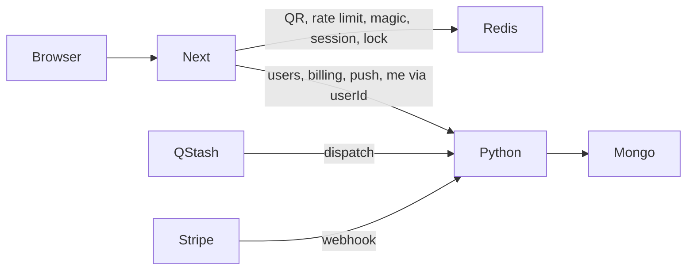

# Migracja Redis → Mongo (wariant 1.A + 2.B)

## Decyzje tego wariantu

- **Architektura (A):** Python/FastAPI + Mongo = źródło prawdy dla danych trwałych; Next woła HTTP API (wzór `DOWOZY_API_BASE_URL`).
- **Redis (B):** QR transfer, rate limity, **magic link**, **sesje (sliding TTL)**, dispatch lock.
- **Mongo:** users, entitlements, Stripe orders/receipts, push subscriptions (+ plan/kinds/sent). **Bez** magic i sessions.

Powiązany plan (magic + sesje też w Mongo): [Redis to Mongo (2.A)](redis_to_mongo_a0493646.plan.md).

---

## Podział odpowiedzialności

| Dane                             | Gdzie                   | Uwagi                                                                    |
| -------------------------------- | ----------------------- | ------------------------------------------------------------------------ |
| Transfer QR                      | Redis (Next)            | bez zmian, AES-GCM + TTL 15 min                                          |
| Rate limity                      | Redis (Next)            | `@upstash/ratelimit`                                                     |
| Magic challenge + attempts       | Redis (Next)            | TTL 15 min, getdel — jak dziś w [`auth/store.ts`](src/lib/auth/store.ts) |
| Sessions                         | Redis (Next)            | sliding 30d via `EXPIRE`                                                 |
| Users + email index              | Mongo (Python)          | durable identity                                                         |
| Entitlements / orders / receipts | Mongo (Python)          | durable commercial                                                       |
| billing-return (2h)              | Redis OK albo Mongo TTL | przy 2.B naturalnie Redis                                                |
| Push records                     | Mongo (Python)          |                                                                          |
| Dispatch lock                    | Redis                   | SET NX EX 60                                                             |

**Sesja vs user:** Next po magic verify:

1. Redis: consume magic → email
2. Python: `ensureUser(email)` → `userId`
3. Redis: `createSession(userId)`
4. Cookie `sb_session` jak dziś

`getCurrentUser`: Redis `readSession` → `userId`, potem Python `GET /api/v1/users/{id}` (lub `/me` z userId z sesji). Email może być w odpowiedzi Mongo albo cache’owany tylko po stronie serwera — nie duplikować trwale w Redis poza session `{ userId }`.

---

## Faza 0 — Kontrakt (jak 2.A, węższy auth)

Endpointy Python (bez magic/session store):

| Odpowiedzialność | Python                                                |
| ---------------- | ----------------------------------------------------- |
| Users            | `POST /api/v1/users/ensure`, `GET /api/v1/users/{id}` |
| Billing          | checkout (opcjonalnie), webhook, `GET entitlement`    |
| Push             | subscribe/plan/kinds/test/dispatch                    |
| Rozkłady         | już: dowozy/mzk                                       |

Next **zostawia** Route Handlers:

- `/api/auth/magic-link`, `verify`, `logout` — logika Redis lokalnie + wywołanie `ensureUser` do Python przy sukcesie verify
- rate limity, settings-transfer — bez zmian

Auth między Next ↔ Python: `BACKEND_INTERNAL_TOKEN` na ensure/get user, billing reads, push writes.

---

## Faza 1 — Schema Mongo (bez magic/sessions)

- **`users`**, **`entitlements`**, **`stripe_orders`**, **`stripe_receipts`**, **`push_subscriptions`** — jak w planie 2.A
- **Brak** kolekcji `magic_challenges` / `sessions`
- Indeksy: unique email, `pi_` idempotencja, `push.userId`

---

## Faza 2 — Users cutover (auth hybrydowy)

1. Python: `ensureUser` + `getUser` (port z Redis user keys).
2. Next [`ensureUser`](src/lib/auth/store.ts) / ścieżka w [`flow.ts`](src/lib/auth/flow.ts): zamiast Redis user keys → HTTP; **magic + session zostają w Redis**.
3. Migracja one-shot: `school-bus:user:*` + `user:email:*` → Mongo.
4. `getCurrentUser`: session z Redis + profil z Python (fallback: jeśli Python down → 503 / null, nie „udawaj” usera).

Dual-write users (krótko): write Mongo (+ Redis legacy) → cutover read → drop Redis user keys.

---

## Faza 3 — Billing (jak 2.A)

- Webhook Stripe → Python (Mongo grant/revoke).
- Next checkout: sesja z Redis, entitlement z Python.
- Przy revoke: Python kasuje push w Mongo.
- Rate limity checkout zostają w Redis (Next).

---

## Faza 4 — Push + QStash (jak 2.A)

- Store + dispatch w Python/Mongo; lock w Redis.
- QStash URL → Python.
- Migracja push records z Redis → Mongo.
- Next push routes → proxy; bramka Plus: session Redis + entitlement Python.

---

## Faza 5 — Cleanup (węższy niż 2.A)

Usunąć z Next tylko durable Redis dla **users / billing / push**.

**Zostawić** Redis clients dla:

- settings-transfer
- wszystkie rate-limit
- auth magic + session (`getAuthRedis` / fragment `AuthKv`)
- lock (jeśli po stronie Next; przy QStash→Python lock w Python/Upstash)

Zaktualizować docs/politykę: konto/Plus/push = Mongo; login ephemeral + sesja = Redis.

---

## Porównanie wariantów: 2.A vs 2.B

Oba mają **1.A** (Python źródłem prawdy HTTP). Różnica = gdzie żyją **magic** i **sesje**.

| Kryterium                                    | 2.A (magic+sesje w Mongo)                                    | 2.B (magic+sesje w Redis) — ten plan                                  |
| -------------------------------------------- | ------------------------------------------------------------ | --------------------------------------------------------------------- |
| Zakres migracji                              | Szerszy: cały auth store                                     | Węższy: users/billing/push                                            |
| Złożoność Next auth                          | Proxy wszystkich auth routes                                 | Auth verify zostaje lokalnie + 1 call `ensureUser`                    |
| TTL / sliding session                        | TTL index + update `expiresAt` przy każdym `me`              | Natywne Redis `EXPIRE` (już działa)                                   |
| Magic getdel / race                          | Trzeba poprawnie zamodelować w Mongo                         | Redis `GETDEL` bez zmian                                              |
| Zależność logowania od Python                | Pełna (brak backendu = brak logowania)                       | Magic w Redis działa; bez Python nie powstanie user/session po verify |
| Zależność `getCurrentUser`                   | Zawsze HTTP                                                  | Redis session + HTTP po profil/email                                  |
| Liczba hopów na request chroniony            | 1× Python `me`                                               | Redis + często 1× Python user/entitlement                             |
| Operacje / backup                            | Sesje w dumpie Mongo                                         | Sesje giną z Redis (OK)                                               |
| Ryzyko utraty sesji przy migracji            | Migracja sesji albo wylogowanie wszystkich                   | Sesje nietknięte przy migracji users                                  |
| Spójność „wszystko durable w jednym miejscu” | Wyższa                                                       | Auth rozproszony Redis+Mongo                                          |
| Koszt / vendor                               | Mniej Redis (tylko QR+limits+lock)                           | Więcej kluczy Redis (auth ephemeral)                                  |
| Cleanup w Next                               | Można mocno okroić `AuthKv`                                  | `AuthKv`/auth Redis zostaje na stałe                                  |
| Dopasowanie do „Redis = ephemeral”           | Magic/sesje też ephemeral w Mongo (TTL) — mniej idiomatyczne | Magic/sesje w Redis — najbardziej idiomatyczne                        |

### Kiedy wybrać który

- **2.B (ten plan)** — szybszy, bezpieczniejszy cutover; mniejszy rewrite auth; naturalny podział ephemeral/durable. Rekomendowany jako **pierwszy krok produkcyjny**.
- **2.A** — gdy chcesz jeden magazyn po stronie backendu (Mongo) i Next bez logiki sesji/magic; sensowne jako **drugi krok** po ustabilizowaniu 2.B, albo od razu jeśli budujesz auth od zera w Python i nie zależy Ci na zachowaniu istniejących sesji Redis.

### Ścieżka ewolucji (opcjonalna)

1. Wdrożyć **2.B** (users → billing → push).
2. Później przenieść magic+sesje do Python/Mongo (= dojście do **2.A**) bez zmiany kontraktu billing/push.

Dzięki temu porównanie nie jest „albo–albo na zawsze”, tylko kolejnością faz — o ile kontrakt `ensureUser` / `me` od początku nie zakłada sesji w Mongo.
