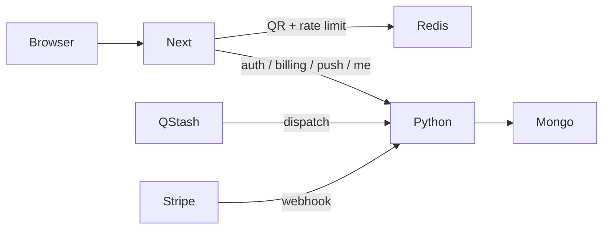

# Migracja Redis → Mongo (Python jako źródło prawdy)

## Decyzje (ustalone)

- **Architekturа:** Python/FastAPI + Mongo = źródło prawdy; Next woła HTTP API (wzór jak dziś [`src/lib/dowozy/api-client.ts`](src/lib/dowozy/api-client.ts) / `DOWOZY_API_BASE_URL`).
- **Redis zostaje tylko na:** transfer QR, rate limity (`@upstash/ratelimit`), opcjonalnie `school-bus:push:lock` (SET NX EX).
- **Do Mongo idą:** users, magic challenges, sessions, entitlements, Stripe orders/receipts, push subscriptions (+ plan/kinds/sent).

## Stan obecny (skrót)

| Domenа                         | Dziś (Redis)                     | Docelowo                                          |
| ------------------------------ | -------------------------------- | ------------------------------------------------- |
| Users / email index            | `school-bus:user:*`              | Mongo `users`                                     |
| Magic link + attempts          | TTL 15 min                       | Mongo + TTL index (albo Redis — **nie**: wybór A) |
| Sessions (sliding 30d)         | `school-bus:session:*`           | Mongo + `expiresAt` TTL / update on read          |
| Entitlement / orders / receipt | billing keys                     | Mongo collections                                 |
| Push records + by-user index   | push keys                        | Mongo `push_subscriptions`                        |
| Transfer QR                    | TTL 15 min, AES-GCM              | **Redis** (bez zmian)                             |
| Rate limity                    | Upstash Ratelimit                | **Redis** (bez zmian)                             |
| Dispatch lock                  | SET NX 60s                       | **Redis** (zostaje)                               |
| QStash cron                    | `POST` Next `/api/push/dispatch` | `POST` Python (np. `/api/v1/push/dispatch`)       |

Backend Python jest **poza tym repo** — tu planujemy kontrakt API, proxy w Next oraz wycofanie trwałego Redis.

---

## Faza 0 — Kontrakt i wspólne env

1. Ujednolicić base URL backendu (dziś `DOWOZY_API_BASE_URL`):
   - albo rozszerzyć ten sam host o nowe ścieżki `/api/v1/...`,
   - albo dodać `BACKEND_API_BASE_URL` i stopniowo spiąć klienta rozkładów.
2. Ustalić auth między Next ↔ Python:
   - **server-to-server** (webhook Stripe, QStash, wewnętrzne `getCurrentUser`): nagłówek `Authorization: Bearer $BACKEND_INTERNAL_TOKEN` (lub mTLS w przyszłości),
   - **sesja użytkownika:** Next nadal ustawia cookie `sb_session` (same-origin PWA); po verify Python zwraca `sessionId` + user; Next podpisuje cookie jak dziś (`AUTH_SECRET`); odczyt usera = HTTP do Python `GET /api/v1/auth/me` z `sessionId`.
3. Spisać OpenAPI / krótką tabelę endpointów (mirror obecnych Route Handlers):

| Next (obecnie)                          | Python (docelowo)                                                                                                                                                 |
| --------------------------------------- | ----------------------------------------------------------------------------------------------------------------------------------------------------------------- |
| `POST /api/auth/magic-link`             | `POST /api/v1/auth/magic-link`                                                                                                                                    |
| `GET\|POST /api/auth/magic-link/verify` | `POST /api/v1/auth/magic-link/verify`                                                                                                                             |
| `POST /api/auth/logout`                 | `POST /api/v1/auth/logout`                                                                                                                                        |
| `getCurrentUser` (server)               | `GET /api/v1/auth/me`                                                                                                                                             |
| `POST /api/billing/checkout`            | `POST /api/v1/billing/checkout` (lub Next tworzy Stripe session, Python tylko entitlement — **wybór: Stripe + webhook w Python**, żeby zapis był atomowy w Mongo) |
| `POST /api/billing/webhook`             | `POST /api/v1/billing/webhook`                                                                                                                                    |
| `POST\|DELETE /api/push/subscribe` itd. | `/api/v1/push/*`                                                                                                                                                  |
| `POST /api/push/dispatch`               | `/api/v1/push/dispatch` (+ weryfikacja QStash)                                                                                                                    |

Checkout może chwilowo zostać w Next (Stripe SDK), a grant/revoke tylko przez webhook w Python — ale docelowo **cały billing write-path w Python**, żeby nie dublować logiki z [`src/lib/billing/webhook.ts`](src/lib/billing/webhook.ts).

---

## Faza 1 — Schema Mongo (Python)

Kolekcje (mapowanie 1:1 z obecnymi rekordami):

- **`users`:** `_id` (UUID jak dziś), `email` (unique, normalized), `createdAt`
- **`magic_challenges`:** `token`, `email`, `codeHash`, `attempts`, `expiresAt` (TTL index); unique partial na aktywny token per email
- **`sessions`:** `sessionId`, `userId`, `expiresAt` (TTL); sliding = `updateOne` + nowe `expiresAt` przy `me` / read (odpowiednik `EXPIRE` w [`readSession`](src/lib/auth/store.ts))
- **`entitlements`:** `userId` unique, `status`, `validUntil`, Stripe ids
- **`stripe_orders`:** `_id` = `pi_…`, `status`, `userId`, `validUntil`, `customerId`, `renewal`
- **`stripe_receipts`:** `_id` = `pi_…`, `sentAt` (idempotencja maila)
- **`billing_returns`:** `userId`, `expiresAt` TTL 2h (albo krótki Redis — przy wyborze A też Mongo z TTL)
- **`push_subscriptions`:** `_id` = sha256(endpoint), `subscription`, `plan`, `sentOn`, `sent[]`, `scheduleFingerprint`, `kinds`, `userId`; indexy: `userId`, ewentualnie compound pod dispatch

Zachować semantyke: magic `getdel` / burn, SET NX na email→user, idempotencja webhooka po `pi_`.

---

## Faza 2 — Auth w Python + cienki Next

**Python:** przenieść logikę z [`src/lib/auth/store.ts`](src/lib/auth/store.ts), [`flow.ts`](src/lib/auth/flow.ts), wysyłkę maila (Resend) albo zostawić mail w Next po odpowiedzi Python — preferencja: **mail w Python**, jeden write-path.

**Next:**

- Route Handlers auth → proxy (forward body/IP, map statusy PL jak dziś).
- [`getCurrentUser`](src/lib/auth/current-user.ts) → HTTP `me` zamiast Redis.
- `isAuthAvailable()` → health/config backendu, nie `getAuthRedis()`.
- Rate limity auth **zostają w Next** (Redis) przed proxy.

Migracja danych: skrypt one-shot Redis → Mongo dla `user:*` + `user:email:*` (bez magic/session — ephemeral).

---

## Faza 3 — Billing

**Python:** port [`webhook.ts`](src/lib/billing/webhook.ts) + store entitlement/order/receipt; Stripe signature verify przed zapisem; przy revoke — delete push by user (Mongo).

**Next:**

- `POST /api/billing/webhook` → proxy albo przekierowanie URL w Stripe Dashboard na Python (preferowane: **Stripe wskazuje na Python**, mniej hopów).
- Checkout: Next lub Python tworzy Checkout Session; metadata `user_id` tylko z zweryfikowanej sesji (`me`).
- [`readEntitlement`](src/lib/billing/store.ts) / [`src/lib/push/access.ts`](src/lib/push/access.ts) → HTTP do Python.

Rate limity checkout/complaint zostają w Redis (Next).

---

## Faza 4 — Push + QStash

**Python:** port [`src/lib/push/store.ts`](src/lib/push/store.ts) + [`dispatch.ts`](src/lib/push/dispatch.ts) (web-push / pywebpush); lock dispatch w **Redis** (Next lub Python z tym samym Upstash — prościej: lock w Python przez Upstash REST albo krótki dokument Mongo z TTL; **domyślnie Redis w Python** tylko na lock, żeby nie mieszać).

**Next:** `/api/push/subscribe|plan|kinds|test` → proxy; bramka Plus przez `me` + entitlement z Python.

**QStash:** zmienić schedule URL na Python `/api/v1/push/dispatch`; przenieść weryfikację signing keys.

Migracja: eksport wszystkich `school-bus:push:*` + index → Mongo (zachować `userId`, `sent`, fingerprint).

---

## Faza 5 — Cleanup w tym repo

Po stabilnym cutoverze:

1. Usunąć durable Redis z auth/billing/push stores; zostawić Redis tylko w:
   - [`src/lib/settings-transfer/*`](src/lib/settings-transfer/)
   - `*/rate-limit.ts` (feedback, transfer, auth, billing, push)
   - opcjonalnie cienki helper lock (jeśli lock zostaje po stronie Next — przy QStash→Python lock idzie z Python).
2. Uprościć / usunąć `AuthKv` + `getAuthRedis` jeśli nic durable ich nie używa.
3. Zaktualizować [`.env.example`](.env.example), README, [`privacy-policy-content.tsx`](src/components/privacy-policy-content.tsx), [`terms-of-service-content.tsx`](src/components/terms-of-service-content.tsx), reguły `.cursor/rules` (data-and-storage, api-and-security, pwa-and-push): Redis = QR + limity; konta/Plus/push = Mongo via backend.
4. Testy: mock HTTP backend zamiast in-memory `AuthKv` / Redis; zachować testy domenowe (dispatch due-trips, webhook signature) przeniesione lub zdublowane w Python.
5. Semver: podbić przy user-facing zmianie komunikatów / polityce (jeśli tekst prawny się zmienia).

---

## Kolejność wdrożenia (produkcja)

1. Deploy Python z API + pustymi kolekcjami + health.
2. Migracja users (+ push, entitlements, orders) z Redis → Mongo (okno niskiego ruchu).
3. Przełączenie Next na proxy / `me` (feature flag `BACKEND_API_BASE_URL` + fallback Redis **tylko w okresie dual-read**, potem wyłączyć).
4. Stripe webhook → Python; QStash → Python.
5. Wyłączenie dual-write/read; usunięcie kodu durable Redis.

Dual-read (krótko): write tylko Mongo, read Mongo z fallback Redis — albo odwrotnie write both — **wybór domyślny planu:** krótki **dual-write** (Next/Python pisze Mongo + Redis) przez 1–2 dni, potem cutover read→Mongo, potem wyłączenie Redis durable. Przy małej bazie dopuszczalny też big-bang migracja + restart.

---

## Poza zakresem tego repo (ale na checklistie Python)

- Indeksy TTL Mongo, unique email, idempotencja `pi_`.
- Resend / Stripe / VAPID / QStash secrets w env Python.
- Observability: logi bez treści planu lekcji / tokenów.
- Testy integracyjne webhook + magic verify + push subscribe gate.

## Ryzyka

- **Sesje w Mongo:** sliding TTL wymaga `expiresAt` update przy każdym `me` — OK przy niskim RPS; przy wzroście rozważyć cache sesji w Redis (świadomie poza obecnym wyborem A).
- **Cookie boundary:** Python nie powinien polegać na CORS cookie z innej domeny — Next zostaje same-origin BFF.
- **Stripe / QStash cutover:** kolejność: najpierw Python gotowy, potem zmiana URL w dashboardach, potem usunięcie starych handlerów.
- **Prawne teksty** muszą wymienić Mongo / backend zamiast „Upstash Redis” dla kont i Plus.
